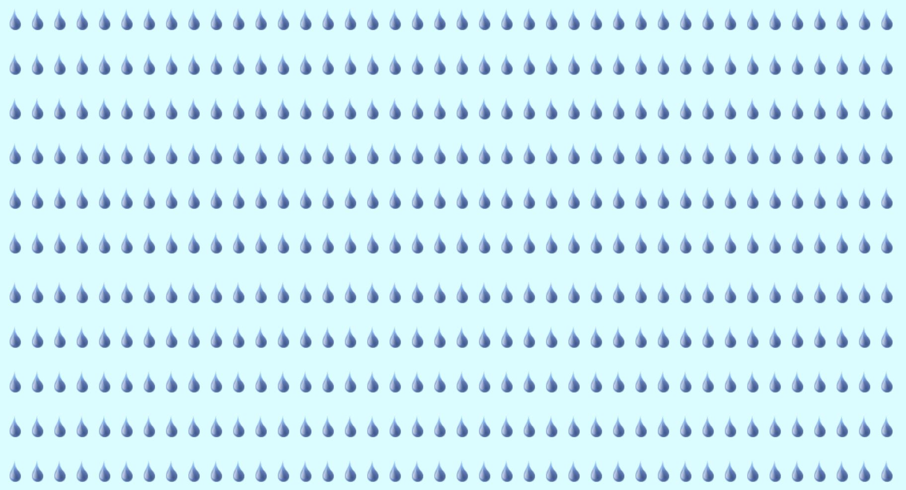

# Learning Pygame
Objective: To learn basic functions of pygame.

# Sideways Shooter
In this spaceship can be controlled to move up and down using arrow keys, as well as it can shoot bullets on pressing spacebar. 
Just run sideways_shooter.py

# Rocket
A rocket appears on the centre of the screen, which can be moved anywhere on the screen using arrow keys. 
Just run rocket_game.py

# Rainfall 
In this the water drops fall from top to bottom of the screen.
Just run rainfall.py

# Star Grid
It creates stars randomly on the screen.
Just run star_grid.py

# Requirement
- Python 3.x
- Pygame

# Reference 
- The "Python Crash Course" book by Eric Matthes 
